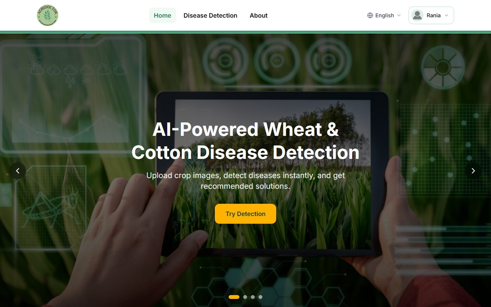
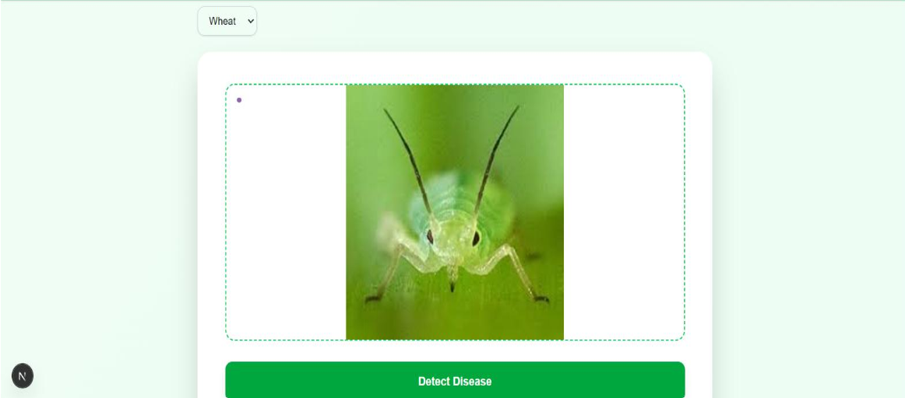
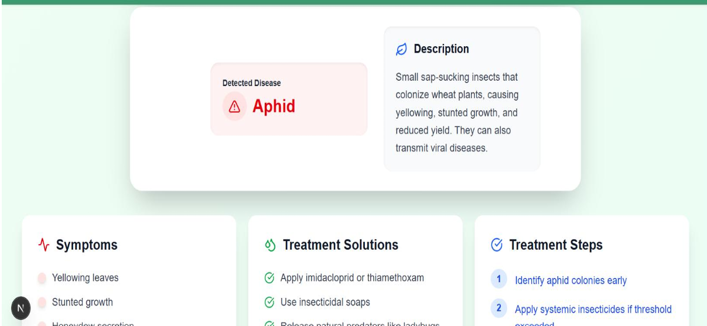
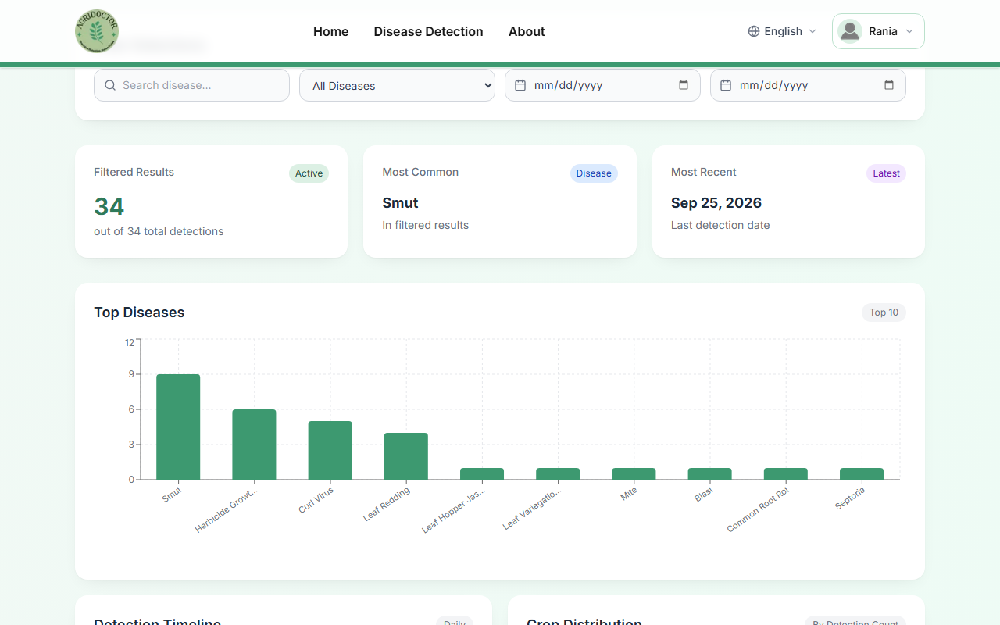
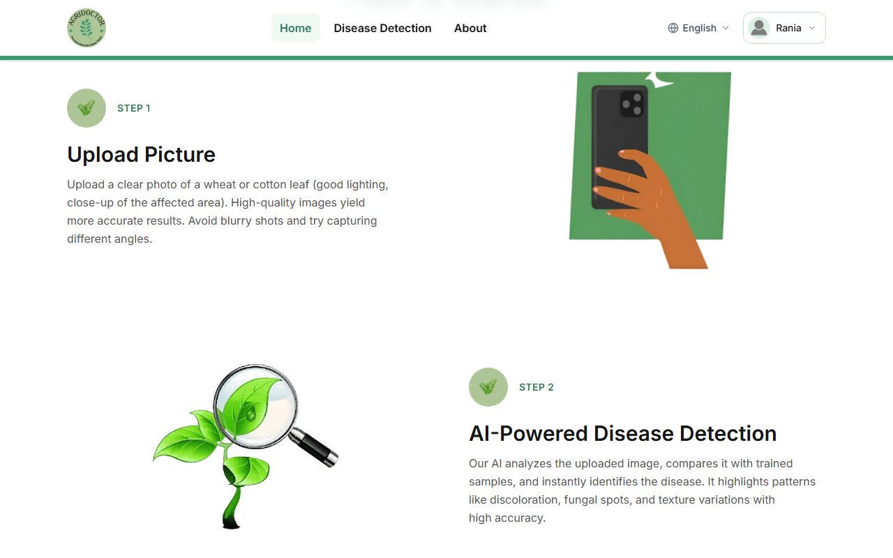
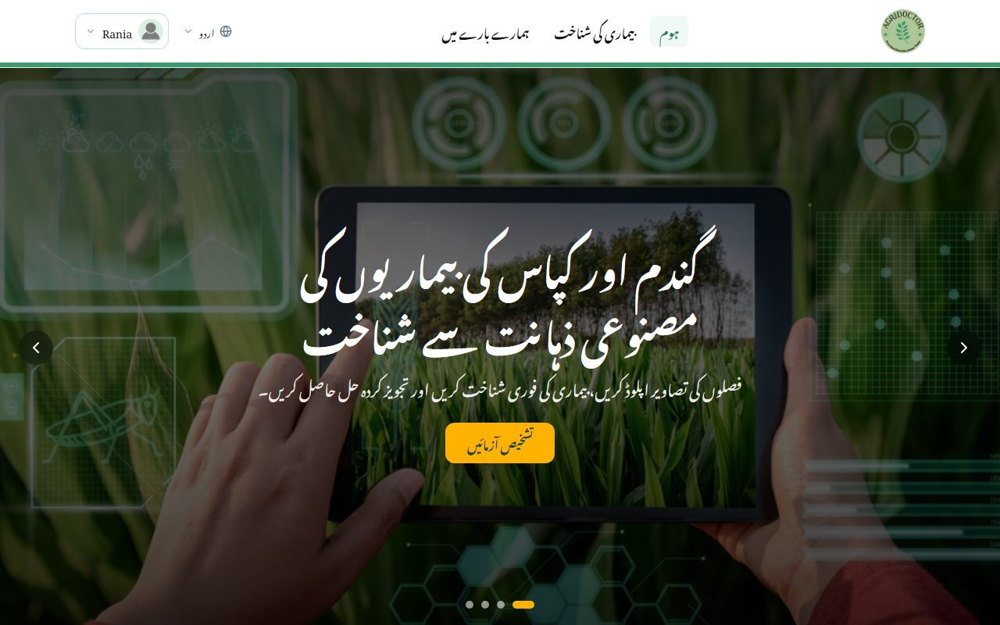
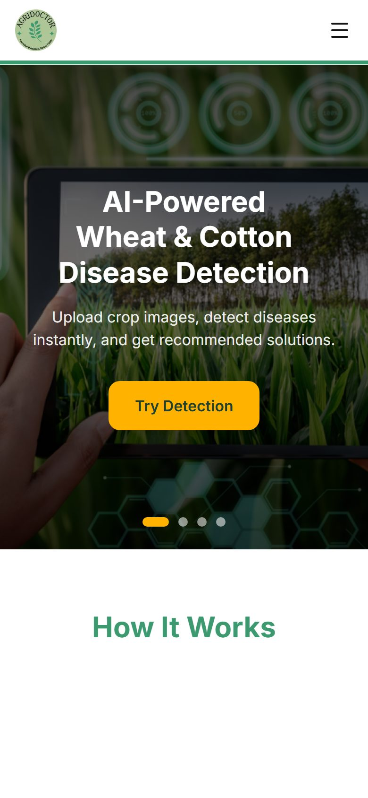

# Crop Disease Detection System

[](https://github.com/RaniaIjaz/cropDiseaseDetection/actions/workflows/ci.yml)

A full-stack final-year project for detecting wheat and cotton diseases from leaf images. The system combines trained deep-learning models with a bilingual web application, user authentication, prediction history, and report management.



## Screenshots

### Diagnosis

Pick the crop, upload a leaf image, and run detection. The image is checked with CLIP first, so a photo that is not the selected crop is rejected before it reaches the model.



The result gives the disease and a description, then symptoms, treatment solutions and step-by-step treatment, followed by prevention measures and preventive guidelines.



### Detection history

Every prediction is stored and charted: top diseases, a daily timeline, and the split between crops.



### How it works



### Bilingual — English and Urdu

The Urdu locale is fully right-to-left, with the layout mirrored and a Nastaliq typeface.



### Responsive



## Highlights

- Wheat and cotton disease classification from uploaded images
- Image validation with CLIP before model inference
- English and Urdu user interfaces
- JWT-based registration and login
- Email OTP password recovery
- Persistent prediction reports and image metadata in MongoDB
- Responsive dashboard with prediction history and charts
- Interactive FastAPI documentation

## Tech stack

| Layer | Technologies |
| --- | --- |
| Frontend | Next.js 15, React 19, Redux Toolkit, Tailwind CSS, next-intl |
| Backend | FastAPI, Motor, MongoDB, Pydantic |
| Machine learning | TensorFlow/Keras, PyTorch, Hugging Face Transformers/CLIP |
| Authentication | JWT, Passlib, bcrypt |

## Repository structure

```text
.
├── crop-disease-detection-frontend/  # Next.js web application
└── disease-detection-backend/        # FastAPI API and trained models
```

The frontend and backend are committed as ordinary directories, so a standard clone contains the complete project.

## Run locally

### Prerequisites

- Node.js 20 or newer
- Python 3.11 or newer
- A running MongoDB instance or MongoDB Atlas database

### 1. Backend

```bash
cd disease-detection-backend
python -m venv .venv
```

Activate the environment:

```powershell
# Windows PowerShell
.venv\Scripts\Activate.ps1
```

```bash
# macOS or Linux
source .venv/bin/activate
```

Install dependencies and configure the application:

```bash
pip install -r requirements.txt
cp .env.example .env
uvicorn app.main:app --reload
```

On Windows Command Prompt, use `copy .env.example .env` instead of `cp`.

The API runs at `http://localhost:8000`; Swagger UI is available at `http://localhost:8000/docs`.

To seed the disease reference data after configuring MongoDB:

```bash
python upload_to_mongo.py
```

### 2. Frontend

In a second terminal:

```bash
cd crop-disease-detection-frontend
npm ci
npm run dev
```

Open `http://localhost:3000`.

## Environment variables

Create `disease-detection-backend/.env` from the committed `.env.example` file.

| Variable | Purpose |
| --- | --- |
| `MONGO_URI` | MongoDB connection string |
| `JWT_SECRET` | Secret used to sign access tokens |
| `JWT_ALGORITHM` | JWT signing algorithm; defaults to `HS256` |
| `BASE_URL` | Public backend URL used for generated image links |
| `MAIL_USERNAME` | SMTP account username |
| `MAIL_PASSWORD` | SMTP app password |
| `MAIL_FROM` | Sender address for password-reset messages |
| `MAIL_PORT` | SMTP port; defaults to `587` |
| `MAIL_SERVER` | SMTP host; defaults to `smtp.gmail.com` |

Never commit the real `.env` file. It is ignored by Git.

## Main API routes

- `POST /auth/register` and `POST /auth/login`
- `POST /auth/forget-password` and `POST /auth/reset-password`
- `POST /predict/predict-disease/`
- `POST /predict/cotton/`
- `POST /predict/wheat/`
- `GET /reports/{report_id}`
- `GET /reports/user/{user_id}`

See `/docs` for request schemas and the complete generated API reference.

## Models and datasets

The trained Keras model files and class-name mappings are included under `disease-detection-backend/models/` so the project works after cloning.

Training data sources:

- [Wheat Plant Diseases dataset](https://www.kaggle.com/datasets/kushagra3204/wheat-plant-diseases/data)
- [Cotton disease image dataset](https://prod-dcd-datasets-public-files-eu-west-1.s3.eu-west-1.amazonaws.com/4ea42385-6559-41b1-9934-b69c4b769305)
